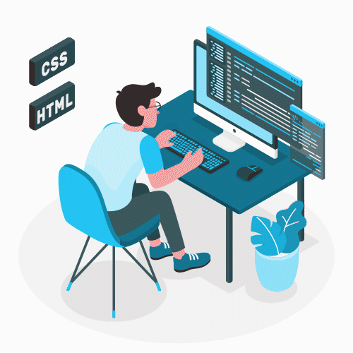

<!--
### Hi there 👋
**robsonvinicius/robsonvinicius** is a ✨ _special_ ✨ repository because its `README.md` (this file) appears on your GitHub profile.

Here are some ideas to get you started:

- 🔭 I’m currently working on ...
- 🌱 I’m currently learning ...
- 👯 I’m looking to collaborate on ...
- 🤔 I’m looking for help with ...
- 💬 Ask me about ...
- 📫 How to reach me: ...
- 😄 Pronouns: ...
- ⚡ Fun fact: ...

- 🌍 And I also like to travel

:man_technologist:

My name is Robson and ...:

  

-->

# Robson Vinicius de Oliveira 

### Hellooo!  Welcome to my profile
 
<!-- 
### Hellooo! 👋 Welcome to my profile
-->

My name is Robson and...

 <!-- - 😄 I really like to learn --> 
 - 📊 I'm working with Graphic Design, UI/UX Design and Front End
 - 📚 Currently studying UX/UI and React
 - 🏡 Brazilian, Based in Curitiba-PR 
 

## 

 
### You can find me on:

 

##

### Languages and Tools:

<!--  -->
<!--  -->
<!--  -->
<!-- -->
<!--  -->
<!--  -->

  

 

 <!-- Gráfico de linguagens mais utilizadas 
 

-->

<!--

 

--> 
 

