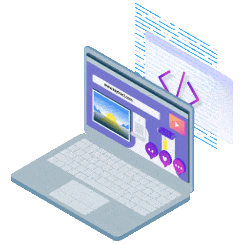

**APOIO NA CONSTRUÇÃO**: https://readme.so/pt

## APRESENTAÇÃO

### Hellooo! 👋 Welcome to my profile

### Hi there 👋
**robsonvinicius/robsonvinicius** is a ✨ _special_ ✨ repository because its `README.md` (this file) appears on your GitHub profile.

Here are some ideas to get you started:

- 🔭 I’m currently working on ...
- 🌱 I’m currently learning ...
- 👯 I’m looking to collaborate on ...
- 🤔 I’m looking for help with ...
- 💬 Ask me about ...
- 📫 How to reach me: ...
- 😄 Pronouns: ...
- ⚡ Fun fact: ...
- 😄 I really like to learn: ...

- 🌍 And I also like to travel

- :man_technologist:

My name is Robson and ...:

 

## BADGES

  

 

 

 

 

## LANGUAGES AND TOOLS

**Adobe XD**

**Adobe After Effects**

**Adobe Illustrator**

**Adobe Photoshop**

**Adobe Premiere**

**Docker**

**Figma**

**Firebase**

**Flutter**

**Framer**

**Gatsby**

**Github**

**GraphQL**

**Go**

**hexo**
</a> 

**InVision**
</a> 

**java**

**jenkins**
 

**kotlin**

**kubernetes**

**linux**

**Miro**

**MongoDB**

**MySQL**

**NodeJS**

**Python**

**React**

**React JS** 

**React Native**

**Sass**

**Sketchapp**

**Terminal**

**Typescript**

**Vegas**

**VueJS**

**webpack**

**zeplin**

 

## GRÁFICO DE ESTÁTISTICAS

### Gráfico de linguagens mais utilizadas

## Gráficos Stats

## Top Langs
 

 

## Animations

### Hello

  

### Dino Google

   

### Emoji Glasses

  

### Hello Type

   

### Letterbox

          

### Lightning

   

### Message

   

### This page is

   

   

<!-- Computador -->

   

   

   

   

   

